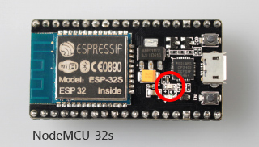
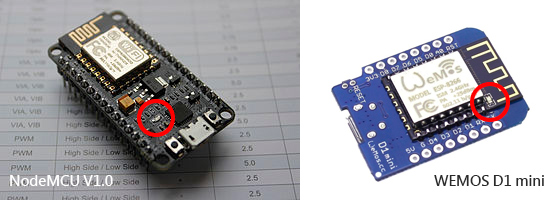

## ESP32 / ESP8266 WebServer Sample 
##### Control built-In led from webpage which located on SPIFFS or external SD card. #####

**Device Requirement**

Chip module base on ESP32 or ESP8266 with support `LED_BUILTIN`. Ex: 
- Built-in led on NodeMCU-32S base on ESP32 chip.  

- Built-in led on NodeMCU, WEMOS D1/mini, base on ESP8266 chip. 
 
   
**Software Requirement**
- Downlad & install [Arduino IDE](https://www.arduino.cc/en/Main/Software) 
https://www.arduino.cc/en/Main/Software

- Arduino code for ESP32 
https://github.com/espressif/arduino-esp32  

- Arduino code for ESP8266 
https://github.com/esp8266/Arduino

**How to work ?**
1. Launch Arduino IDE and open file [**WebServerSDSPIFFS.ino**](https://github.com/benjenq/WebServerSDSPIFFS/blob/master/WebServerSDSPIFFS.ino) . 
2. Fill up your wifi parameter `ssid` and `password` related to your network enviroment.
3. Choose one from SPIFFS or SD Card Reader:
   Mark or Unmark `#define USE_SPIFFS` in [**BeSD_SPIFFS.h**](https://github.com/benjenq/WebServerSDSPIFFS/blob/master/BeSD_SPIFFS.h) (Line 36) 
   See header comment in [**BeSD_SPIFFS.h**](https://github.com/benjenq/WebServerSDSPIFFS/blob/master/BeSD_SPIFFS.h)
4. Build and upload the firmware to ESP32 or ESP8266 module with Arduino IDE.
5. Use "Sketch Data Upload" tools to upload all files data\\\*.\* to SPIFFS , or copy all files data\\\*.\* to SD card. See [data\\README.md](https://github.com/benjenq/WebServerSDSPIFFS/blob/master/data/README.md) for more information.
6. Use web browser to connect to this webserver (**http://esp32webserver.local** for ESP32 module, or **http://esp8266webserver.local** for ESP8266 module) . 
7. Done.

**Known issue (ESP32 ONLY)** *Fixed if use library [ESPAsyncWebServer](https://github.com/me-no-dev/ESPAsyncWebServer). See [Branch](https://github.com/benjenq/WebServerSDSPIFFS/tree/ESPAsyncWebServer)*
- ESP32: Web Server is **Very Very** slow. Get error message ``Failed to load resource: net::ERR_CONNECTION_RESET`` via Google Chrome. Hope it could be solve if [official version](https://github.com/espressif/arduino-esp32) library *WebServer* or SDK could be.

